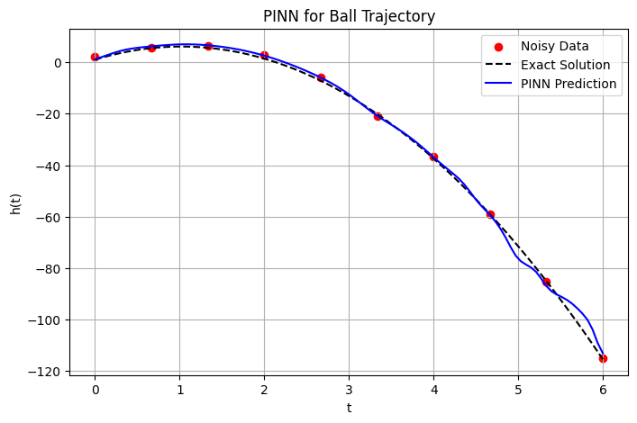

# Physics-Informed Neural Network (PINN) for Ball Trajectory

A simple PyTorch implementation of Physics-Informed Neural Networks (PINNs) applied to a fundamental physics problem - the trajectory of a ball under gravity.

## Problem Description

This project models the height of a ball over time, governed by the equation:

$$h(t) = h_0 + v_0t - 0.5gt^2$$

where:
- $h_0$ = 1.0 (initial height)
- $v_0$ = 10.0 (initial velocity)
- $g$ = 9.8 (acceleration due to gravity)

## Implementation

The PINN uses a simple feedforward neural network to learn the solution while respecting:

1. **Physics constraints**: The ODE $\frac{dh}{dt} = v_0 - gt$
2. **Initial condition**: $h(0) = h_0$
3. **Data fitting**: Limited noisy measurements

The loss function combines these constraints with tunable weights:
L = λ_data * L_data + λ_ode * L_ode + λ_ic * L_ic
## Features

- Automatic differentiation for computing derivatives in the physics loss
- Synthetic data generation with adjustable noise
- Visualization of PINN predictions against exact solution
- Adjustable hyperparameters for loss weighting

## Results

**The PINN demonstrates excellent performance throughout the entire trajectory:**

- The blue PINN prediction line closely tracks the black exact solution

- Strong agreement across all time points from t=0 to t=6

- The model successfully learns the physics despite the presence of noisy data

- Even in regions with sparse or noisy data points, the PINN maintains accuracy
- The trained PINN successfully recovers the true physics-based trajectory even with limited and noisy data points, demonstrating how incorporating physics into neural networks enhances their predictive power and generalization capabilities.
